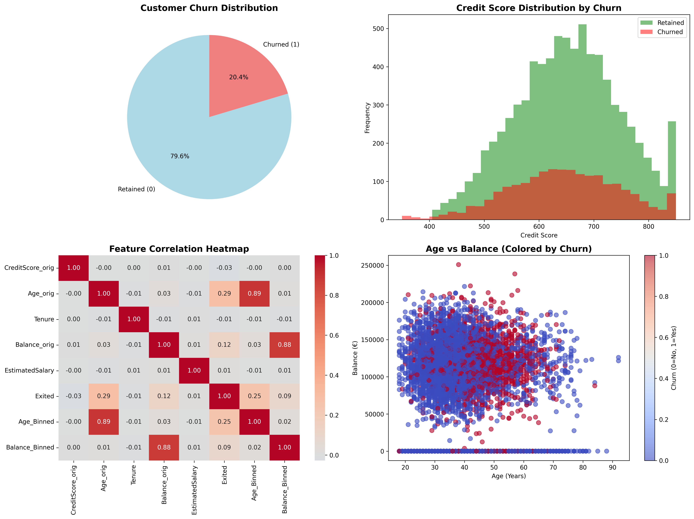

# Bank Analytics Pipeline

### Raghad Ramadan 231000818 
### Sara Reda 231001650

### Docker hub link : 
   https://hub.docker.com/repository/docker/wdwg/customer-analytics
## 1. Overview
This repository contains a customer churn analytics pipeline with Docker support.
The pipeline:
- Ingests raw data: `ingest.py`
- Preprocesses for modelling: `preprocess.py`
- Generates insights: `analytics.py`
- Creates visual summary: `visualize.py`
- Runs clustering: `cluster.py`
- Copies results: `summary.sh`

## 2. docker commands

- `docker build -t customer-analytics . ` (Build)

- `docker run -it --name customer-container customer-analytics` (Run)

  #### push to docker hub: 

   - `docker login`
   - `docker tag customer-analytics username/customer-analytics:latest`
   - `docker push username/customer-analytics:latest`

   #### pull from docker hub : 
   - `docker images`
   - `docker pull username/customer-analytics:latest`
## 3. Execution flow
1. From host, build image.
2. Run container.
3. Inside container, run:
   - `python ingest.py Bank.csv`
   - `python preprocess.py`
   - `python analytics.py`
   - `python visualize.py`
   - `python cluster.py`
4. Exit container: `exit`
5. Copy outputs with host script: `bash summary.sh`

## 4. Output files
Expected results in `results/`:
- `data_raw.csv`
- `data_preprocessed.csv`
- `insight1.txt`
- `insight2.txt`
- `insight3.txt`
- `summary_plot.png`
- `clusters.txt`

## 5. Sample run
### Ingest
`python ingest.py Bank.csv` → creates `data_raw.csv`

### Preprocess
`python preprocess.py` → creates `data_preprocessed.csv`

### Analytics
`python analytics.py` → creates insights:
- `insight1.txt`
- `insight2.txt`
- `insight3.txt`

### Visualize
`python visualize.py` → creates `summary_plot.png`

### Cluster
`python cluster.py` → creates `clusters.txt`

### Summary
`bash summary.sh` → copies files  + stops/removes container

## 6. Screenshots / sample outputs
- `results/summary_plot.png` (plot output)
- `results/insight1.txt`, `insight2.txt`, `insight3.txt` (text insights)
- `results/clusters.txt` (cluster distribution)


### insight text output 
#### `insight1.txt`
```
INSIGHT 1: Customer Churn Analysis

Overall Churn Rate: 20.38%

Churn by Gender:
 Male customers: 16.46%
 Female customers: 25.08%

Churn by Geography:
 Germany: 32.46%
 Spain: 16.68%
 France: 16.16%
```

#### `insight2.txt`
```
INSIGHT 2: Credit Score Impact on Churn

Average Credit Score:
 Churned customers: 645.35
 Retained customers: 651.87

Insight: Retained customers have 6.52 points higher credit scores on average
Conclusion: Higher credit scores correlate with lower churn risk
```

#### `insight3.txt`
```
INSIGHT 3: Age and Balance Analysis
Age Analysis:
 Churned customers avg age: 44.84 years
 Retained customers avg age: 37.41 years

Balance Analysis:
 Churned customers avg balance: €91108.54
 Retained customers avg balance: €72739.86

Churn Rate by Age Group:
 Age Group 1: 8.68%
 Age Group 2: 29.27%
```

### clustering  (`clusters.txt`)
```
Cluster 0: 1300 customers (13.0%)
Cluster 1: 2770 customers (27.7%)
Cluster 2: 2596 customers (26.0%)
Cluster 3: 3331 customers (33.3%)
```

### Visualization



